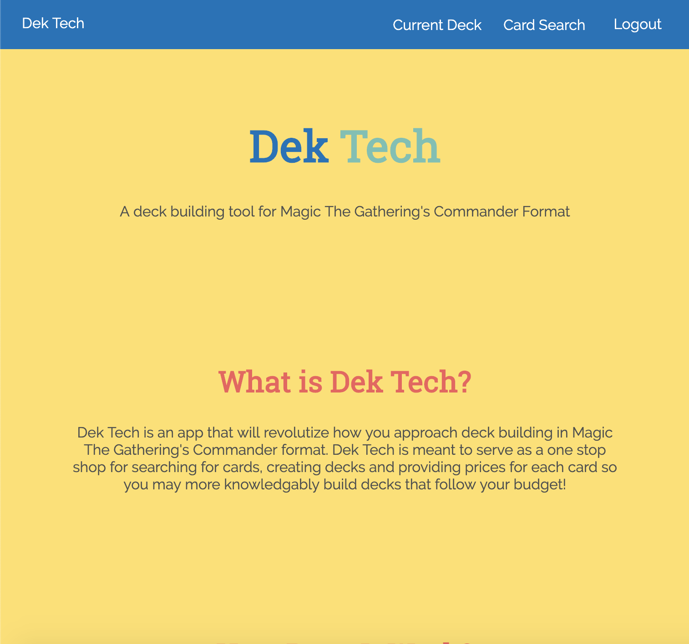
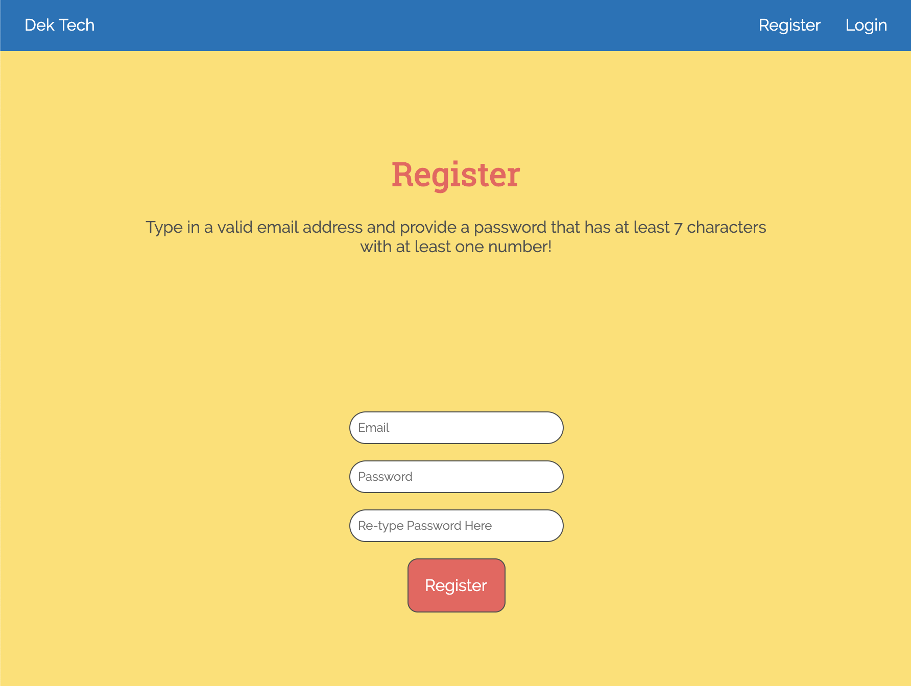
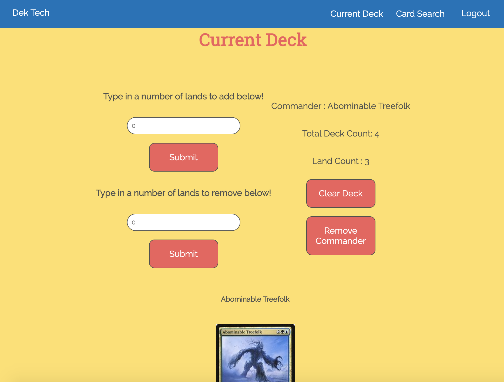
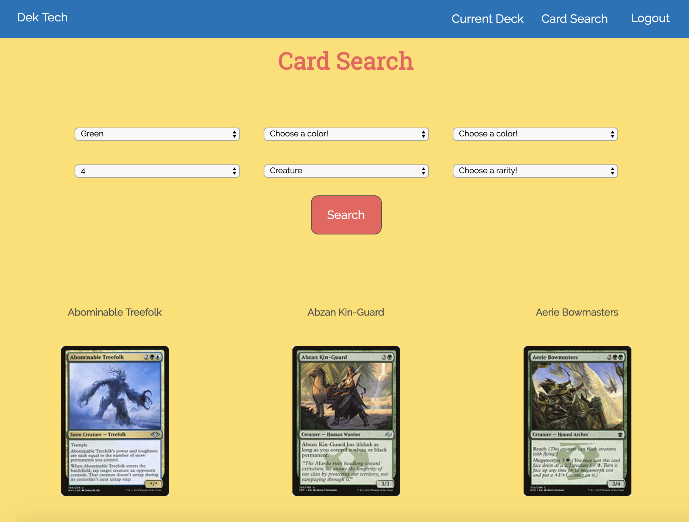

# MTG Deck Builder

## Contents
* Description
* Features
* Technologies
* Challenges and Solutions
* MVP
* Stretch Goals

## Description
The MTG Deck Builder is a MERN stack web application that will allow users to create their own MTG Commander Format decks. The user is able to search for cards using as few or as many parameters as they'd like and they are able to add cards to their deck from their searches. 

## Features
* Users are able to search for cards based on 
* Users can create up to a 100 card deck with no duplicates for the Commander Format in Magic the Gathering
* Users can add a variable number of lands, and set a commander so they can better understand their deck's purpose/theme
* UI has been put in place for the user's current deck profile so they can see how many cards they have left to work with

## Technologies
- HTML/CSS/JavaScript
- CSS Modules
- MongoDB/Mongoose
- Node.js/Express
- React/Redux
- Scryfall API

## Challenges & Solutions
* Authentication
- When I decided to work on this, authentication was one of the big things I wanted to improve my knowledge of. I utilized JSON Web Tokens with custom middleware to check the validity of the token for any "protected" route that I wanted to have. Here is the middleware function I wrote to check the token for each request : 
```
    const auth = (req, res, next) => {
    const token = req.header("x-auth-token");
    // console.log(token)
    if(!token){
        return res.json({
            token : null,
            message : "No valid token found",
            isAuthenticated : false,
            deck : {
                cards : [],
                lands : 0,
                commander : "",
                message : "",
            }
        });
    };
    
    try {
        const decodedToken = jwt.verify(token, config.jwtSecret);
        req.user = decodedToken;
        next();
    } catch(err){
        return res.json({
            token : null,
            message : "Expired token",
            isAuthenticated : false,
            deck : {
                cards : [],
                lands : 0,
                commander : "",
                message : "",
            }
        })
    };
};
```
* Creating persistent sessions to communicate back end session to front end
- Another thing I wanted to better improve were my skills related to creating persistent state and information between my back end and front end. I have utilized sessions on the back end before, but couldn't previously figure out a solution for effectively saving state that is impacted from my back end. The functions below demonstrate how I architected my local storage usage and how my Redux store will constantly update my local storage to reflect updated state.

Getting the state and saving the state to local storage : 
```
    const middleware = applyMiddleware(reduxPromise);
    const theStore = middleware(createStore);

    const loadFromLocalStorage = () => {
        try{
            const serializedState = localStorage.getItem("state");
            if(serializedState === null){
                return undefined;
            }
            return JSON.parse(serializedState);
        } catch(err){
            console.log(err);
        }
    };

    export const saveToLocalStorage = state => {
        try {
            const serializedState = JSON.stringify(state);
            localStorage.setItem("state", serializedState);
        } catch(err){
            console.log(err)
        }
    };

    const persistedState = loadFromLocalStorage();

    export const store = theStore(reducers, persistedState);

```
Subscribing the store so when it updates, it will save the updated state to local storage:
```
    store.subscribe( () => saveToLocalStorage(store.getState()));
```
* Design
- One thing I tried to be mindful of was color combinations. I am by NO MEANS a designer but I wanted to try and better my knowledge of accessability and good color combinations. I researched colors for almost two weeks before starting this project so I had a solid game plan in mind for each element and how I wanted them styled.
* Protected Routing
- Another thing I wanted to do better was protected routing. After trying a couple different ways to handle this, I decided to create a function that essentially checks my auth state and returns either the component or a redirect component if the user is not authenticated. In order to constantly check the validity of the token, I also created an action that would fire off the componentDidMount lifecycle function in my Navbar and update state based on that response.
Protected wroting example with the function I created to check state and redirect a user to the home is they were not authenticated:
```
    const ProtectedRoutes = props => {
        const protectedRoute = Component => { return props.auth.isAuthenticated? Component : () => <Redirect to="/"/>};
        return(
            <Switch>
                <Route exact path="/" component={Splash}/>
                <Route exact path="/register" component={Register}/>
                <Route exact path="/login" component={Login}/>
                <Route exact path="/userHome" component={protectedRoute(UserHome)}/>
                <Route exact path="/currentDeck" component={protectedRoute(CurrentDeck)}/>
                <Route exact path="/cardSearch" component={protectedRoute(CardSearch)}/>
                <Route exact path={`/cardInfo/:cardId`} component={protectedRoute(CardInfo)}/>
                <Route component={ErrorPage}/>
            </Switch>
        )
    }
```
Check token action that was utilized in my Navbar component :
```
export const checkTokenAction = () => {

    const token = tokenConfig();

    const axiosPromise = axios.get(`${window.apiHost}/auth/checkToken`, token);
    
    return{
        type : CHECK_TOKEN_ACTION,
        payload : axiosPromise
    }
};
```

* Refactoring
- Throughout this project, I constantly refactored and revised my code as I learned new things. I rearchitected my Redux store and back end responses to be more concise and allow for my multiple reducers to handle the same action and extract exactly what I needed from each request. If I wanted to continue to work on this, I would definitely go back and create better reusable components through my application.

## MVP
* User should be able to create an account - Complete
* User should be able to search for cards using various conditions (Mana color, Converted Mana Cost, Power, etc) - Complete
* User should be able to create a deck of 100 cards - Complete


## Stretch Goals
* Incorporate different formats outside of Commander - Incomplete
* Allow users to store multiple decks - Incomplete
* Allow users to get price estimates for each card searched and link them to TCGplayer for each card if they'd like to purchase it - Incomplete
* Users can see a chart of the different types of cards in the deck - Incomplete

## Screenshots
* Home Page

* Register

* Current Deck

* Card Search

